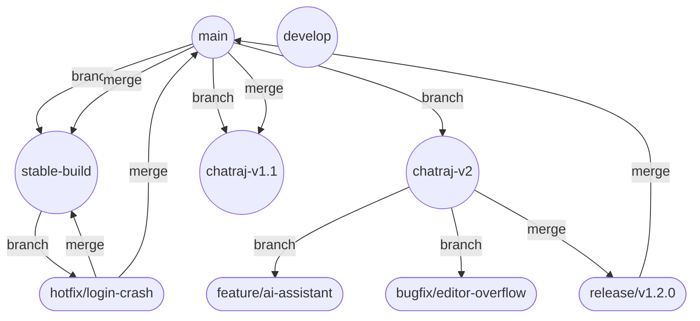
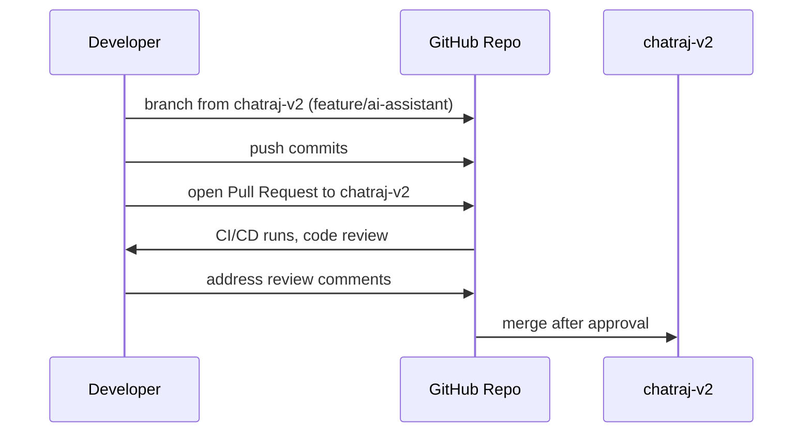
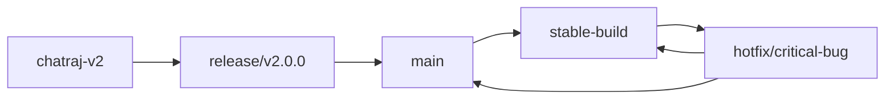
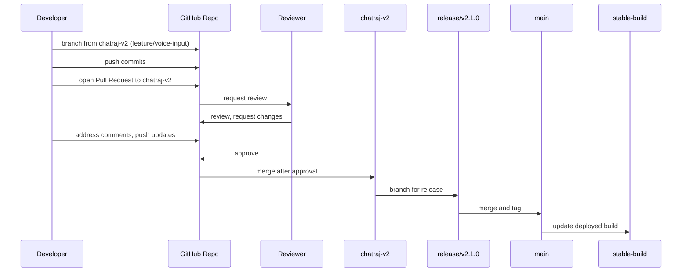

# Git Workflow

This document describes the professional Git workflow adopted for the ChatRaj project. It is designed to ensure code quality, traceability, and efficient collaboration, following best practices inspired by leading organizations such as Microsoft, Google, and Apple.

---

## Table of Contents

- [Git Workflow](#git-workflow)
  - [Table of Contents](#table-of-contents)
  - [Branching Strategy](#branching-strategy)
  - [Branch Naming Conventions](#branch-naming-conventions)
  - [Workflow Diagrams](#workflow-diagrams)
    - [1. High-Level Branching Model](#1-high-level-branching-model)
    - [2. Feature Development Lifecycle](#2-feature-development-lifecycle)
    - [3. Release \& Hotfix Flow](#3-release--hotfix-flow)
  - [Commit Message Guidelines](#commit-message-guidelines)
  - [Pull Request Process](#pull-request-process)
  - [Code Review Process](#code-review-process)
  - [Release Management](#release-management)
    - [Release Branches](#release-branches)
    - [Release Checklist](#release-checklist)
  - [Hotfixes \& Emergency Patches](#hotfixes--emergency-patches)
  - [Tagging \& Versioning](#tagging--versioning)
  - [Best Practices](#best-practices)
  - [Example: Full Feature Workflow](#example-full-feature-workflow)
  - [References](#references)

---

## Branching Strategy

We use a **hybrid trunk-based and release-based development** model with the following long-lived branches:

- **main**: Always production-ready. Only stable, tested code is merged here. All releases are tagged from this branch.
- **chatraj-v2**: Major version 2 development. Used for large architectural changes and next-gen features.
- **stable-build**: Mirrors the latest production deployment. Used for hotfixes and emergency patches.
- **chatraj-v1.1**: Maintenance branch for v1.1.x releases. Critical bugfixes and security patches only.

Short-lived branches are created for features, bugfixes, releases, and experiments:

- **feature/\***: New features (e.g., `feature/ai-assistant`, `feature/file-upload`)
- **bugfix/\***: Bug fixes (e.g., `bugfix/chat-scroll`, `bugfix/editor-overflow`)
- **release/\***: Release preparation (e.g., `release/v1.2.0`)
- **hotfix/\***: Urgent production fixes (e.g., `hotfix/login-crash`)
- **experiment/\***: Prototypes and research (e.g., `experiment/webassembly-support`)

---

## Branch Naming Conventions

| Branch Name         | Purpose                                         | Example                        |
|---------------------|-------------------------------------------------|--------------------------------|
| main                | Production-ready code                           | main                           |
| chatraj-v2          | Major version 2 development                     | chatraj-v2                     |
| stable-build        | Mirrors latest deployed build                   | stable-build                   |
| chatraj-v1.1        | Maintenance for v1.1.x                          | chatraj-v1.1                   |
| feature/\*          | New features                                    | feature/voice-input            |
| bugfix/\*           | Bug fixes                                       | bugfix/file-tree-sync          |
| release/\*          | Release preparation                             | release/v1.2.0                 |
| hotfix/\*           | Urgent production fixes                         | hotfix/critical-auth-bug       |
| experiment/\*       | Prototypes, research                            | experiment/ai-prompt-tuning    |

---

## Workflow Diagrams

### 1. High-Level Branching Model

### 2. Feature Development Lifecycle

### 3. Release & Hotfix Flow

---

## Commit Message Guidelines

We use [Conventional Commits](https://www.conventionalcommits.org/) for clarity and automation.

- **Format:** `<type>(scope): short description`
- **Types:** `feat`, `fix`, `docs`, `style`, `refactor`, `test`, `chore`, `perf`, `ci`
- **Examples:**
  - `feat(chat): add emoji reactions`
  - `fix(editor): resolve code area overflow on mobile`
  - `docs(readme): update usage guide`
  - `refactor(socket): modularize event handlers`
  - `perf(file-tree): optimize rendering for large projects`

**Commit Body (optional):**
- Use for detailed explanations, links to issues, or migration notes.

**Footer (optional):**
- Reference issues, breaking changes, or co-authors.
  - `BREAKING CHANGE: file format updated`
  - `Closes #42`

---

## Pull Request Process

1. **Branch from the correct base** (`chatraj-v2`, `main`, or `stable-build`).
2. **Push commits** to your feature/bugfix branch.
3. **Open a Pull Request** (PR) to the target branch.
4. **PR Requirements:**
   - Clear title and description.
   - Reference related issues (e.g., `Closes #42`).
   - Pass all CI checks (lint, build, tests).
   - Assign reviewers and request review.
   - Add screenshots or diagrams for UI/UX changes.
   - Update documentation and `CHANGELOG.md` if needed.
5. **No direct commits to `main`, `chatraj-v2`, or `stable-build`**—all changes go through PRs.

---

## Code Review Process

- At least **one approval** is required before merging.
- Reviewers check for:
  - Code correctness, maintainability, and style.
  - Test coverage and passing tests.
  - Security and privacy considerations.
  - Documentation and changelog updates.
- Use GitHub review tools for comments, suggestions, and approvals.
- Address all review comments before merging.
- Use [GitHub Discussions](https://docs.github.com/en/discussions) for architectural or controversial changes.

---

## Release Management

### Release Branches

- **Create `release/x.y.z`** from `chatraj-v2` (or `main` for patch releases).
- Finalize documentation, update `CHANGELOG.md`, and bump version.
- Run full regression and integration tests.
- Merge `release/x.y.z` into `main` and tag the release.
- Merge back into `chatraj-v2` and `stable-build` to keep branches in sync.
- Deploy from `main` to production.

### Release Checklist

- [ ] All features and bugfixes merged.
- [ ] All tests passing (unit, integration, E2E).
- [ ] Documentation and changelog updated.
- [ ] Version bumped in `package.json` and `CHANGELOG.md`.
- [ ] Release notes drafted and reviewed.
- [ ] Tag created and pushed.
- [ ] Production deployment verified.

---

## Hotfixes & Emergency Patches

- Branch `hotfix/issue-#` from `stable-build` or `main` for urgent production fixes.
- Apply the fix, test, and open a PR to `stable-build` and `main`.
- After merge, also merge `main` back into `chatraj-v2` and other active branches to propagate the fix.
- Tag the hotfix release.

---

## Tagging & Versioning

- Use [Semantic Versioning](https://semver.org/): `MAJOR.MINOR.PATCH`
- Tag releases on `main` (e.g., `v2.0.0`).
- Annotate tags with release notes and changelog links.
- Example:
  - `git tag -a v2.0.0 -m "Release v2.0.0: AI Assistant, Real-time Collaboration"`
  - `git push origin v2.0.0`

---

## Best Practices

- **Small, focused commits:** Each commit should address a single concern.
- **Descriptive branch names:** Use `feature/`, `bugfix/`, `hotfix/`, or `release/` prefixes.
- **Keep branches up to date:** Regularly rebase or merge the base branch into your branch.
- **Write tests:** All new features and bugfixes must include relevant tests.
- **Update documentation:** Keep `README.md`, `CHANGELOG.md`, and other docs current.
- **Automated CI/CD:** All PRs must pass automated checks before merging.
- **Code ownership:** Assign code owners for critical modules.
- **Security:** Review dependencies and follow secure coding practices.
- **Accessibility:** Ensure UI changes meet accessibility standards.
- **Communication:** Use PR descriptions, comments, and diagrams to clarify changes.

---

## Example: Full Feature Workflow

---

## References

- [Conventional Commits](https://www.conventionalcommits.org/)
- [Semantic Versioning](https://semver.org/)
- [GitHub Flow](https://docs.github.com/en/get-started/quickstart/github-flow)
- [GitHub Discussions](https://docs.github.com/en/discussions)
- [GitHub Actions](https://docs.github.com/en/actions)
- [GitHub Projects](https://docs.github.com/en/projects)

---

_This workflow is designed to ensure high-quality, maintainable, and secure software delivery for the ChatRaj project. For questions or suggestions, please open a discussion or contact the maintainers._