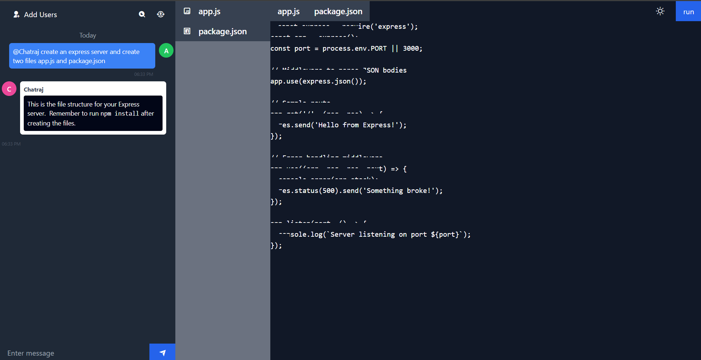

# ChatRaj – AI-Powered Software Engineering Collaboration Platform

ChatRaj is a comprehensive, AI-powered platform designed to streamline software engineering collaboration. It combines intelligent code assistance, real-time chat, project management, and advanced privacy controls in a single, modern environment. Built on the MERN stack, ChatRaj empowers development teams to work smarter and faster.

---

## Table of Contents

- [ChatRaj – AI-Powered Software Engineering Collaboration Platform](#chatraj--ai-powered-software-engineering-collaboration-platform)
  - [Table of Contents](#table-of-contents)
  - [Features](#features)
    - [Real-time Collaboration](#real-time-collaboration)
    - [AI-Powered Assistance](#ai-powered-assistance)
    - [User Experience](#user-experience)
    - [Privacy \& Security](#privacy--security)
    - [Project Management](#project-management)
    - [Code Editor \& Execution](#code-editor--execution)
  - [Tech Stack](#tech-stack)
  - [Architecture Overview](#architecture-overview)
  - [Screenshots](#screenshots)
    - [Homepage](#homepage)
    - [Login](#login)
    - [Categories](#categories)
    - [Dashboard](#dashboard)
    - [Project Workspace](#project-workspace)
    - [Welcome Screen](#welcome-screen)
    - [ChatRaj AI Assistant](#chatraj-ai-assistant)
    - [Logout](#logout)
  - [Getting Started](#getting-started)
    - [Prerequisites](#prerequisites)
    - [Installation](#installation)
    - [Configuration](#configuration)
    - [Running the Application](#running-the-application)
  - [Project Structure](#project-structure)
  - [Usage Guide](#usage-guide)
    - [User Registration \& Login](#user-registration--login)
    - [Creating \& Managing Projects](#creating--managing-projects)
    - [Real-time Collaboration](#real-time-collaboration-1)
    - [AI Assistance](#ai-assistance)
    - [Privacy \& Settings](#privacy--settings)
  - [Contributing](#contributing)
  - [Roadmap](#roadmap)
  - [License](#license)
  - [Contact](#contact)

## Features
### Email & Newsletter

- **Newsletter Subscription:** Users receive a professional confirmation email upon subscribing to the ChatRaj newsletter, delivered via Gmail SMTP. The newsletter email includes upcoming release info and community benefits.
- **Gmail SMTP Integration:** All transactional emails (OTP, newsletter) are sent using Gmail SMTP for reliability and security. Previous fallback/test SMTP logic (Brevo, Ethereal) has been removed for a streamlined setup.

### Real-time Collaboration

- **Live Chat:** Instant messaging with typing indicators and emoji reactions.
- **Multi-user Code Editing:** Edit code together with real-time updates.
- **Project Categories:** Organize projects for better workflow.
- **File Tree Visualization:** View and manage project files with syntax highlighting.
- **Code Execution Environment:** Run code in isolated sandboxes (WebContainers).
- **User Presence Indicators:** See who is online and collaborating.
- **Voice Input:** Real-time speech recognition for hands-free collaboration.

### AI-Powered Assistance

- **AI Code Assistant:** Get code suggestions, explanations, and automation via Google Generative AI.
- **@ChatRaj Mentions:** Directly interact with the AI assistant in chat.
- **Auto-complete Suggestions:** Speed up communication with smart phrase suggestions.

### User Experience

- **Dark/Light Mode:** Switch themes for comfortable coding.
- **Responsive Design:** Works seamlessly on all devices.
- **Animated Transitions:** Smooth UI animations for a modern feel.
- **Customizable Interface:** Adjust chat bubbles, theme colors, font sizes, and more.
- **Multilingual Support:** Use the platform in English, Hindi, Spanish, French, German, or Japanese.

### Privacy & Security

- **Local Chat History:** Manage, clear, or auto-delete chat history.
- **Data Retention Controls:** Set auto-delete intervals and manage local storage.
- **Role-based Access Control:** Secure project collaboration with roles and permissions.
- **JWT Authentication:** Secure user sessions.

### Project Management

- **Category-based Organization:** 15+ predefined categories for efficient project sorting.
- **Invite System:** Collaborate by inviting team members.
- **File System Management:** Real-time updates and file operations.

### Code Editor & Execution

- **Colorful Syntax Highlighting:** The code editor now uses highlight.js themes for vibrant, VS Code-like syntax coloring in both light and dark mode.
- **Run Button Timer:** When running code in the browser, the run button displays a live countdown timer until the WebContainer is ready, so users know exactly when they can execute their code.

---

## Tech Stack

**Backend:**
- Node.js, Express.js
- MongoDB (Atlas) & Mongoose
- Redis (caching, token management)
- JWT (authentication)
- Socket.io (real-time communication)
- dotenv (environment variables)

**Frontend:**
- React (Vite)
- Tailwind CSS, Animate.css
- Remix Icon, Motion.js

**AI Integration:**
- Google Generative AI (`@google/generative-ai`)
- Google Jules
- Speech Recognition API
- Text-to-Speech

---

## Architecture Overview

```
+-------------------+         +---------------------+         +-------------------+
|    Frontend       | <-----> |      Backend        | <-----> |   MongoDB Atlas   |
|  (React, Vite)    |  REST   | (Node, Express,     |  ODM    |   (Database)      |
|  + Socket.io      |  & WS   |  Socket.io, Redis)  |         |                   |
+-------------------+         +---------------------+         +-------------------+
         |                             ^
         |                             |
         v                             |
+-------------------+                  |
|  Google Gen AI    | <----------------+
|  Speech APIs      |
+-------------------+
```

---

## Screenshots

> Below are screenshots demonstrating key features and pages of ChatRaj. All images are located in the `Screenshots` folder.

### Homepage


### Login


### Categories


### Dashboard


### Project Workspace


### Welcome Screen


### ChatRaj AI Assistant


### Logout


---

## Getting Started

### Prerequisites

- **Node.js & npm:** [Download](https://nodejs.org/)
- **MongoDB Atlas Account:** [Sign Up](https://www.mongodb.com/cloud/atlas)
- **Redis Instance:** [Redis Cloud](https://redis.com/try-free/) or local install
- **Google AI API Key:** [Get API Key](https://makersuite.google.com/app/apikey)
- **Git:** [Download](https://git-scm.com/)

### Installation

1. **Clone the Repository**
   ```bash
   git clone https://github.com/Abhirajgautam28/Chatraj.git
   cd ChatRaj
   ```

2. **Install Dependencies**
   ```bash
   # Backend
   cd Backend
   npm install

   # Frontend
   cd ../frontend
   npm install
   ```

### Configuration

1. **Backend Environment Variables**

   Create `Backend/.env`:
   ```env
   PORT=8080
   MONGODB_URI=your_mongodb_atlas_connection_string
   JWT_SECRET=your_jwt_secret
   REDIS_HOST=your_redis_host
   REDIS_PORT=your_redis_port
   REDIS_PASSWORD=your_redis_password
   GOOGLE_AI_KEY=your_google_ai_key
   ```

2. **Frontend Environment Variables**

   Create `frontend/.env`:
   ```env
   VITE_API_URL=http://localhost:8080
   ```


### Running the Application

1. **Start Backend**
   ```bash
   cd Backend
   npm run dev
   ```

2. **Start Frontend**
   ```bash
   cd ../frontend
   npm run dev
   ```

3. **Access the App**
   - Open [http://localhost:5173](http://localhost:5173) in your browser.

---

## Project Structure

```
ChatRaj/
├── Backend/         # Express API, Socket.io, MongoDB, Redis
│   ├── routes/
│   ├── models/
│   ├── controllers/
│   ├── db/
│   ├── server.js
│   └── .env
├── frontend/        # React client
│   ├── src/
│   ├── public/
│   └── .env
└── README.md
```

---

## Usage Guide

### User Registration & Login
- Register a new account or log in with existing credentials.
- JWT-based authentication secures your session.

### Creating & Managing Projects
- Create new projects and organize them by category.
- Invite collaborators and assign roles.
- Manage files and folders with real-time updates.

### Real-time Collaboration
- Use the chat system for instant communication.
- Edit code together in real time.
- See who is online and active in your project.

### AI Assistance
- Mention `@ChatRaj` in chat for code help, explanations, or suggestions.
- Use voice input for hands-free commands and messaging.

### Privacy & Settings
- Manage your chat history and set auto-delete preferences.
- Customize the interface: themes, font sizes, sidebar width, and more.
- Choose your preferred language.

---

## Contributing

We welcome contributions! To get started:

1. **Fork the repository** and create a new branch.
2. **Implement your changes** with clear, concise commits.
3. **Test thoroughly** before submitting.
4. **Open a Pull Request** with a detailed description.

Please follow our [Code of Conduct](CODE_OF_CONDUCT.md) and ensure your code adheres to project standards.

---

## Roadmap

- [ ] **AI Model Training:** Task-specific AI enhancements.
- [ ] **Advanced Debugging:** Real-time error detection and suggestions.
- [ ] **Expanded Language Support:** More languages for global teams.
- [ ] **Visual Studio Code Support:** Provide support for Visual Studio Code in Project Page.
- [ ] **Enhanced Privacy:** Advanced data protection and compliance.
- [ ] **Mobile App:** Native mobile experience.
- [ ] **Plugin System:** Extend ChatRaj with custom plugins.

---

## License

This project is licensed under the [MIT License](LICENSE).

---

## Contact

For questions, support, or feedback:

- **GitHub Issues:** [Open an Issue](https://github.com/Abhirajgautam28/Chatraj/issues)
- **Email:** abhirajgautam28@gmail.com

---

_Thank you for using ChatRaj! If you like this project, please star the repository and share your feedback._

